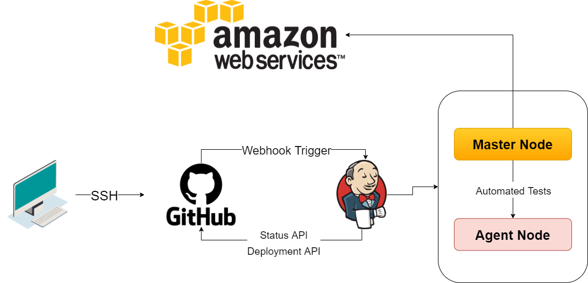

# CICD_with_jenkins


## What is CI/CD?
CI/CD is a method to frequently deliver apps to customers by introducing automation into the stages of app development. The main concepts attributed to CI/CD are continuous integration, continuous delivery, and continuous deployment.

## How to setup up ssh connection with jenkins
Generate new ssh key in your ssh folder and name it (name)jenkins.
Copy public ssh key into github the .pub file - (name)jenkins.pub.
Copy private ssh key into Jenkins - (name)jenkins.
Add the git-hub repo web url in the git project to jenkins.
Add ssh git-hub url into repository URL under the section source code management - git.
Set the execute shell to:
```
cd app
npm install
npm test
```
Save the jenkins job and run the build.
